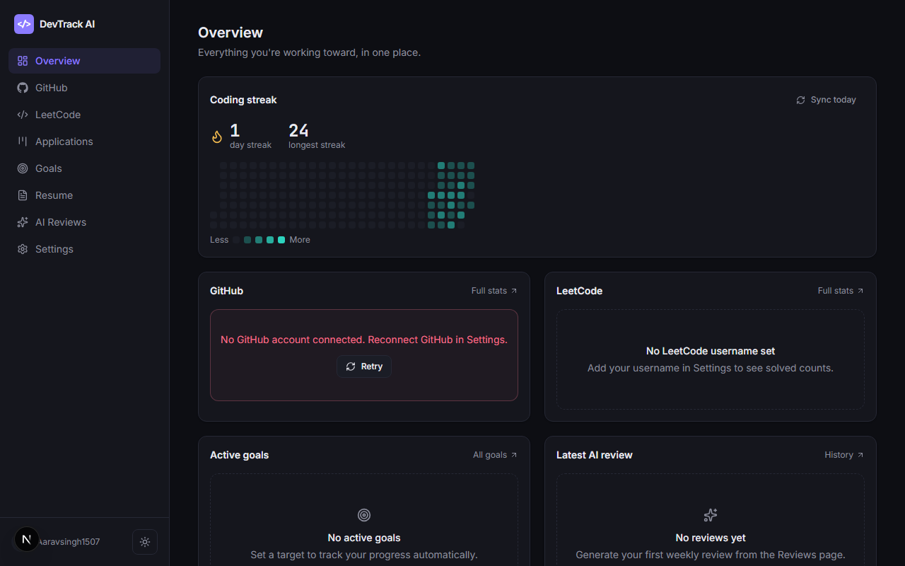
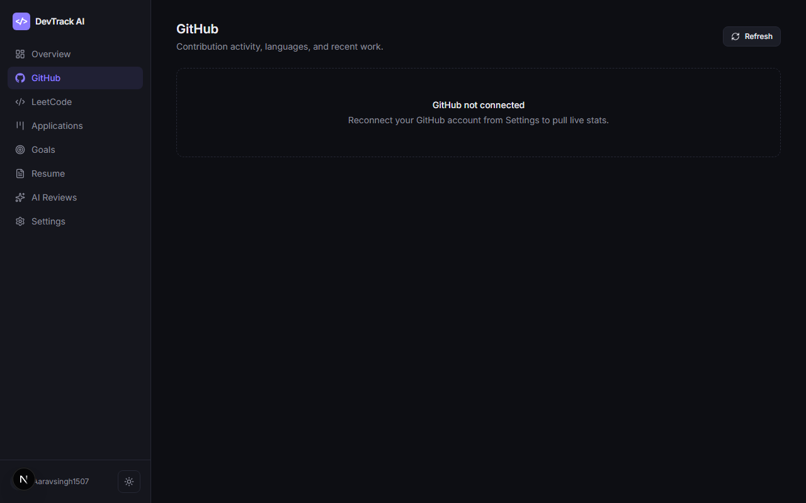
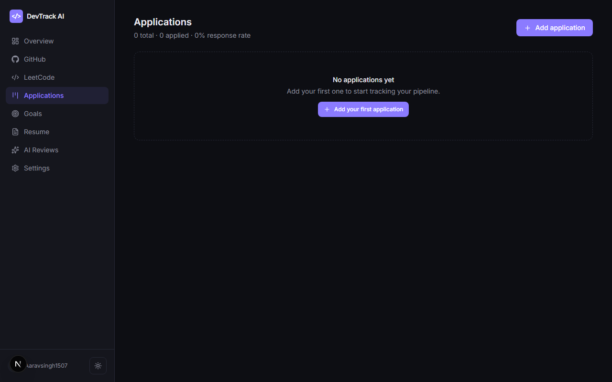

# CodeBoard

**Are you actually placement-ready?**

CodeBoard is a career-readiness dashboard for engineering students — it pulls
your real GitHub activity, LeetCode practice, job applications, and goals
into one place, and turns them into a single **Readiness Score** with
specific, actionable nudges. Not another generic "commit tracker" — this is
built around one question: *what should I actually do this week to get
hired?*

Real Next.js 14 (App Router) + TypeScript + Prisma app. Every number on
screen comes from a real API call — GitHub, LeetCode, and Claude — not
placeholder data.

🔗 **Live Demo:** [codeboard.vercel.app](https://codeboard.vercel.app) (Update URL if you deploy to a different Vercel domain)

---

## Screenshots

> Drop your own screenshots into the `docs/` folder and they'll render here automatically.

| Dashboard | GitHub Stats | Applications |
|---|---|---|
|  |  |  |

---

## What makes this different

Search "devtrack" or "dev tracker" and you'll find a dozen commit-counters
and roadmap-learning apps. CodeBoard isn't trying to be a better commit
counter. It's the only tool that combines:

- **A single Readiness Score (0–100)** — one number combining coding
  consistency, LeetCode volume, job-search momentum, and goal follow-through,
  so you don't have to mentally combine four stat pages yourself.
- **Smart nudges** — "you haven't touched LeetCode in 4 days," "3
  applications haven't moved in 2 weeks" — specific and actionable, not a
  wall of charts.
- **AI resume bullets generated from your actual activity** — no invented
  metrics, drafted straight from your real last-30-days GitHub/LeetCode data.
- **The full loop in one place** — practice, build, apply, and reflect,
  instead of stitching together GitHub + LeetCode + a spreadsheet + a resume
  folder.

## 1. Prerequisites

- Node.js 18.18+ and npm
- A free [GitHub OAuth App](https://github.com/settings/developers)
- An [Anthropic API key](https://console.anthropic.com/) (for AI reviews and resume bullets)

## 2. Setup

```bash
npm install
cp .env.example .env
```

Fill in `.env`:

- **`AUTH_SECRET`** — run `npx auth secret` and paste the result.
- **`GITHUB_CLIENT_ID` / `GITHUB_CLIENT_SECRET`** — create an OAuth App at
  https://github.com/settings/developers with:
  - Homepage URL: `http://localhost:3000`
  - Authorization callback URL: `http://localhost:3000/api/auth/callback/github`
- **`ANTHROPIC_API_KEY`** — from console.anthropic.com. Without this, everything
  else works; only AI weekly reviews and resume bullet generation show an error.
- **`CRON_SECRET`** — any random string.
- **`DATABASE_URL`** — already set to a local SQLite file, no action needed.

Then:

```bash
npx prisma generate
npx prisma db push
npm run build      # confirms a clean compile before you start developing
npm run dev
```

Visit `http://localhost:3000`, sign in with GitHub, and you're in.

## 3. What's actually implemented

| Feature | Status |
|---|---|
| GitHub OAuth login | Real — NextAuth (Auth.js v5) + GitHub provider |
| **Readiness Score** | Real — computed server-side from your actual streak, LeetCode totals, application response rate, and goal pace |
| **Smart nudges** | Real — derived from the same live data (LeetCode inactivity, stale applications, broken streaks) |
| **AI resume bullet generator** | Real — Claude API, grounded in your last 30 days of real GitHub/LeetCode activity, nothing invented |
| GitHub stats (repos, stars, followers, contribution calendar, languages, recent activity) | Real — GitHub GraphQL + REST API, server-cached 4h |
| LeetCode stats | Real — unofficial `leetcode.com/graphql` endpoint, server-cached 4h, degrades gracefully if the endpoint changes |
| Coding streak + heatmap | Real — daily `ActivityLog` rows written by a sync job |
| Resume version tracker | Real — PDF upload, list, download, delete, set-active. Local disk by default — swap before deploying, see section 4 |
| Application/job Kanban tracker | Real — full CRUD, drag-and-drop + dropdown fallback, response-rate stats |
| AI weekly review | Real — aggregates your week's data, calls Claude (`claude-sonnet-4-6`) |
| Goal planner | Real — auto-progress for LeetCode/streak/application goals |
| Dark mode, loading/empty/error states, responsive layout | Implemented throughout |

## 4. Important: file storage before deploying

`src/lib/storage.ts` saves resume PDFs to `public/uploads` on local disk.
This works locally but **will not persist on Vercel** (ephemeral filesystem
outside `/tmp`). Swap `saveFile`/`deleteFile` in that one file for Supabase
Storage or S3 before deploying — the API routes that call it don't change.

## 5. Deploying

1. Spin up a Postgres database (Supabase or Neon, both have free tiers).
2. In `prisma/schema.prisma`, change the datasource provider from `sqlite`
   to `postgresql`, set `DATABASE_URL`, then `npx prisma migrate dev --name init`.
3. Swap resume storage per the note above.
4. Deploy to Vercel, add all `.env` values as environment variables.
5. Update the GitHub OAuth App's callback URL to your production domain,
   and `NEXTAUTH_URL` to match.
6. `vercel.json` already defines two cron jobs (daily activity sync,
   weekly review generation) — Vercel picks these up automatically. Set
   `CRON_SECRET` in your Vercel project's env vars.

## 6. Project structure

```
src/
  app/
    login/, onboarding/              pre-auth pages
    (app)/                           authenticated shell (sidebar nav)
      dashboard/                     Readiness score + streak + summaries
      github/ leetcode/ resume/ applications/ goals/ reviews/ settings/
    api/
      auth/[...nextauth]/            NextAuth handler
      readiness/                     the composite readiness score
      resume/bullets/                AI resume bullet generator
      github/stats/ leetcode/stats/  cached external stats
      activity/sync/ activity/streak/  streak engine
      resume/ applications/ goals/ reviews/  CRUD
      cron/daily-activity/ cron/weekly-review/  scheduled jobs
  components/                        UI + dashboard widgets
  lib/
    readiness.ts                     readiness score + nudge logic
    resume-bullets.ts                AI bullet generation
    github.ts leetcode.ts claude.ts activity.ts weekly-review.ts
    auth.ts prisma.ts storage.ts
prisma/schema.prisma                 full data model
vercel.json                          cron schedule
```

## 7. A note on the LeetCode integration

LeetCode has no official public API. This app uses the same unofficial
GraphQL endpoint LeetCode's own website calls. It needs no auth, but it can
change or rate-limit without notice — every caller catches failures and
falls back to the last successfully cached data instead of crashing the page.

## 8. A note on how this was built

Everything here was verified via static type-checking against hand-written
types matching the real Prisma schema, plus a full `next build` compile
pass — `npx prisma generate` itself needs a binary from `binaries.prisma.sh`
that wasn't reachable from the sandbox this was built in, so that one
specific step needs to run on your machine. First thing after `npm install`:
`npx prisma generate && npm run build` to confirm a clean compile.
