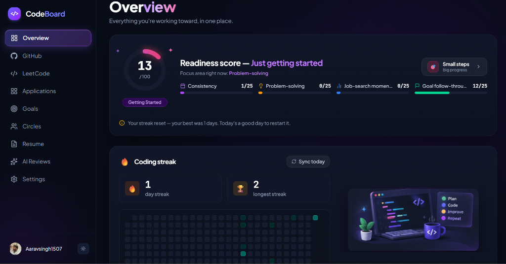
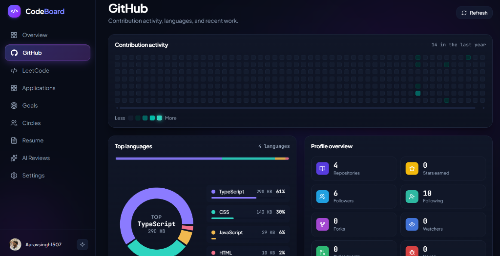
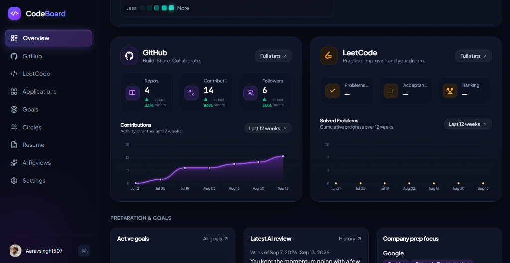
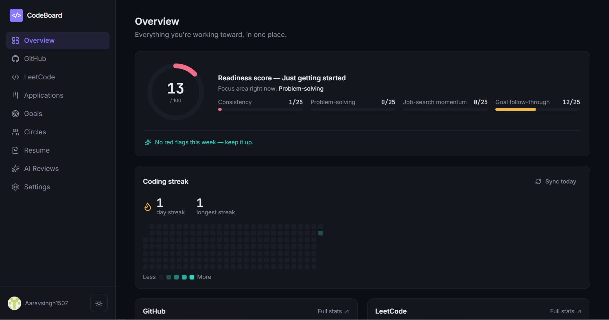

# CodeBoard 🚀

**Live Demo**: [https://codeboard-rho.vercel.app](https://codeboard-rho.vercel.app)

**Are you actually placement-ready?**

CodeBoard is a career-readiness dashboard for engineering students — it pulls
your real GitHub activity, LeetCode practice, job applications, and goals
into one place, and turns them into a single **Readiness Score** with
specific, actionable nudges. Not another generic "commit tracker" — this is
built around one question: *what should I actually do this week to get
hired?*

Real Next.js 14 (App Router) + TypeScript + Prisma app. Every number on
screen comes from a real API call — GitHub, LeetCode, and Groq — not
placeholder data.

---

## 📸 Screenshots

<div align="center">
  
  
  
  
</div>

---

## What makes this different

Search "devtrack" or "dev tracker" and you'll find a dozen commit-counters
and roadmap-learning apps. CodeBoard isn't trying to be a better commit
counter. It's the only tool that combines:

- **A single Readiness Score (0–100)** — coding consistency, LeetCode
  volume, job-search momentum, and goal follow-through in one number.
- **Smart nudges** — specific and actionable, not a wall of charts.
- **AI resume bullets generated from your actual activity** — no invented
  metrics, drafted from your real last-30-days GitHub/LeetCode data.
- **Topic-wise DSA coverage** — not just Easy/Medium/Hard counts, but which
  actual topics (graphs, DP, trees...) you've covered vs. haven't.
- **Company-specific prep focus** — general, publicly-known interview
  patterns matched against your target companies.
- **Interview round tracking with debriefs** — log what was actually asked
  in each round so patterns show up over time.
- **A public, shareable profile page** — one clean link for your resume or
  LinkedIn, showing verified stats without exposing your applications or
  resume files.
- **Placement-date countdown** — goals recompute their weekly pace against
  your actual placement date instead of a static deadline.
- **Study circles** — small opt-in groups where a few batchmates see each
  other's streak and readiness score, for real accountability.
- **A weekly email digest** — reaches people who've gone quiet, not just
  people who remember to open the dashboard.

## 1. Prerequisites

- Node.js 18.18+ and npm
- A free [GitHub OAuth App](https://github.com/settings/developers)
- A [Groq API key](https://console.groq.com/) (for AI reviews and resume bullets)
- Optionally, a free [Resend API key](https://resend.com) for the weekly email digest

## 2. Setup

```bash
npm install
cp .env.example .env
```

Fill in `.env`:

- **`AUTH_SECRET`** — run `npx auth secret` and paste the result.
- **`GITHUB_CLIENT_ID` / `GITHUB_CLIENT_SECRET`** — create an OAuth App at
  https://github.com/settings/developers with:
  - Homepage URL: `http://localhost:3000`
  - Authorization callback URL: `http://localhost:3000/api/auth/callback/github`
- **`GROQ_API_KEY`** — from console.groq.com. Without this, everything
  else works; only AI weekly reviews and resume bullet generation show an error.
- **`GROQ_MODEL`** — optional. Defaults to `openai/gpt-oss-120b` if not set.
- **`CRON_SECRET`** — any random string.
- **`RESEND_API_KEY` / `DIGEST_FROM_EMAIL`** — optional. Without these, the
  weekly digest cron simply no-ops instead of sending email.
- **`DATABASE_URL`** — already set to a local SQLite file, no action needed.

Then:

```bash
npx prisma generate
npx prisma db push
npm run build      # confirms a clean compile before you start developing
npm run dev
```

Visit `http://localhost:3000`, sign in with GitHub, and you're in.

## 3. What's actually implemented

| Feature | Status |
|---|---|
| GitHub OAuth login | Real — NextAuth (Auth.js v5) + GitHub provider |
| **Readiness Score** | Real — computed server-side from your actual streak, LeetCode totals, application response rate, and goal pace |
| **Smart nudges** | Real — derived from the same live data (LeetCode inactivity, stale applications, broken streaks) |
| **AI resume bullet generator** | Real — Groq API, grounded in your last 30 days of real GitHub/LeetCode activity |
| **Topic-wise DSA breakdown** | Real — LeetCode's `tagProblemCounts` GraphQL field, fundamental/intermediate/advanced |
| **Company prep focus** | Curated static dataset matched against your target companies — general public guidance, not scraped/official data |
| **Interview round tracking** | Real — per-application rounds with outcome + free-text debrief, stored in the database |
| **Public shareable profile** | Real — opt-in `/u/[slug]` page, deliberately excludes applications/resume/email |
| **Placement countdown + goal pacing** | Real — set a placement date in Settings, goals show a back-calculated weekly target |
| **Study circles** | Real — create/join via invite code, members see each other's streak + readiness score |
| **Weekly email digest** | Real send via Resend if configured; safe no-op otherwise |
| GitHub stats, LeetCode stats, streak heatmap, resume tracker, application Kanban, AI weekly review, goal planner | Real, as before |
| Dark mode, loading/empty/error states, responsive layout | Implemented throughout |


## 4. Important: file storage before deploying

`src/lib/storage.ts` saves resume PDFs to `public/uploads` on local disk.
This works locally but **will not persist on Vercel** (ephemeral filesystem
outside `/tmp`). Swap `saveFile`/`deleteFile` in that one file for Supabase
Storage or S3 before deploying — the API routes that call it don't change.

## 5. Deploying

The app is already deployed at [https://codeboard-rho.vercel.app](https://codeboard-rho.vercel.app) using:

- **Vercel** for hosting (serverless Next.js)
- **Neon Postgres** (via Vercel's native integration) for the database
- **Prisma** (with `@prisma/adapter-neon`) for the ORM

To deploy your own fork:

1. Fork this repo and import it into [Vercel](https://vercel.com).
2. Create a **Neon Postgres** database from the Vercel Storage tab and connect it to your project.
3. Add these env vars in Vercel Project Settings → Environment Variables:
   - `AUTH_SECRET` — run `npx auth secret` locally and paste the result
   - `GITHUB_CLIENT_ID` / `GITHUB_CLIENT_SECRET` — create a GitHub OAuth App
   - `NEXTAUTH_URL` — your Vercel production URL (e.g. `https://yourapp.vercel.app`)
   - `GROQ_API_KEY` — optional, for AI features
   - `GROQ_MODEL` — optional, defaults to `openai/gpt-oss-120b`
   - `CRON_SECRET` — any random string for securing cron endpoints
   - `RESEND_API_KEY` / `DIGEST_FROM_EMAIL` — optional, for email digest
4. In your **GitHub OAuth App**, set the callback URL to:
   `https://yourapp.vercel.app/api/auth/callback/github`
5. Vercel will run `prisma db push` and `next build` automatically on each deploy.
6. `vercel.json` defines cron jobs for daily activity sync and weekly reviews — Vercel picks these up automatically.

## 6. Project structure

```
src/
  app/
    login/, onboarding/              pre-auth pages
    u/[slug]/                        public shareable profile (no auth)
    (app)/                           authenticated shell (sidebar nav)
      dashboard/                     Readiness score + streak + summaries
      github/ leetcode/ resume/ applications/ goals/ circles/ reviews/ settings/
    api/
      auth/[...nextauth]/            NextAuth handler
      readiness/                     the composite readiness score
      resume/bullets/                AI resume bullet generator
      company-prep/                  company-specific prep matcher
      placement/                     placement countdown
      circles/ circles/join/         study circles
      applications/[id]/rounds/      interview round tracking
      github/stats/ leetcode/stats/  cached external stats
      activity/sync/ activity/streak/  streak engine
      resume/ applications/ goals/ reviews/  CRUD
      cron/daily-activity/ cron/weekly-review/ cron/weekly-digest/  scheduled jobs
  components/                        UI + dashboard widgets
  lib/
    readiness.ts                     readiness score + nudge logic
    resume-bullets.ts                AI bullet generation
    company-prep.ts                  curated company prep dataset
    placement.ts                     countdown + weekly goal pacing
    public-profile.ts                sanitized public profile data
    email.ts                         weekly digest via Resend
    github.ts leetcode.ts groq.ts activity.ts weekly-review.ts
    auth.ts prisma.ts storage.ts
prisma/schema.prisma                 full data model
vercel.json                          cron schedule (3 jobs)
```

## 7. A note on the LeetCode integration

LeetCode has no official public API. This app uses the same unofficial
GraphQL endpoint LeetCode's own website calls. It needs no auth, but it can
change or rate-limit without notice — every caller catches failures and
falls back to the last successfully cached data instead of crashing the page.

## 8. A note on how this was built

Everything here was verified via static type-checking against hand-written
types matching the real Prisma schema, plus a full `next build` compile
pass — `npx prisma generate` itself needs a binary from `binaries.prisma.sh`
that wasn't reachable from the sandbox this was built in, so that one
specific step needs to run on your machine. First thing after `npm install`:
`npx prisma generate && npm run build` to confirm a clean compile.

<!-- Trigger Vercel Build -->

<!-- Trigger Vercel Build After Reconnect -->
